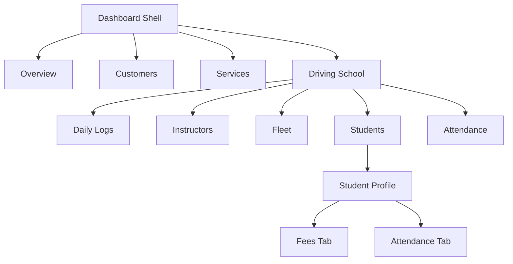

# Driving School Operations Management — PRD & Implementation Plan

## 1. Background & Problem Statement

**Rudra DS** currently manages only **document-related services** (vehicle registrations, licence renewals, etc.) for driving schools. Real driving schools also need to manage:

- **Fleet vehicles** (the school-owned cars students learn on)
- **Instructors / Teachers** who conduct driving lessons
- **Daily driving logs** — which instructor took which car, at what time, and when they released it (instructors may switch cars mid-day)
- **Student enrollment & fee tracking** — adding students, recording agreed fees, payments made, pending balance, and notes
- **Student attendance** — recording which student was taught on which day, automatically linking to the instructor and car

> [!IMPORTANT]
> This is a **new module** added alongside the existing document-services module. It lives under a new `/dashboard/driving` route group and uses **new database tables** — it does NOT modify existing tables.

---

## 2. User Review Required

> [!WARNING]
> **Multi-tenant scope**: All new tables follow the existing `org_id` pattern with RLS. Each driving school sees only its own data. Please confirm this is correct.

> [!IMPORTANT]
> **Payment tracking is read-only**: We track decided fees, amounts paid, and balance — but do NOT process actual payments. Please confirm.

> [!IMPORTANT]
> **Navigation change**: The dashboard sidebar will grow from 3 items (Overview, Customers, Services) to include a new "Driving School" section with sub-navigation. This changes the shell layout.

---

## 3. Open Questions

> [!IMPORTANT]
> 1. **Should instructors be linkable to existing `profiles` (app users)?** Or are they standalone entries (name, phone, licence number) managed independently? — *Plan assumes standalone entries for now, since instructors are typically not logging into the app.*

> [!IMPORTANT]
> 2. **Student ≠ Customer?** The existing `customers` table tracks document-service customers. Should driving students be the same entity (reuse `customers` table) or a separate `ds_students` table? — *Plan assumes a separate `ds_students` table since students have different fields (enrollment date, course type, fee info) and mixing concerns would be messy. They can be linked to a customer record optionally.*

> [!IMPORTANT]
> 3. **Time granularity for driving logs**: Do you need precise timestamps (10:30 AM – 11:45 AM) or just session slots (Morning / Afternoon / Evening)?  — *Plan assumes precise timestamps.*

> [!IMPORTANT]  
> 4. **Should the student attendance page show a calendar-style view or a simple list/table?** — *Plan assumes a list/table view with date filters, which is simpler and more practical for daily operations.*

---

## 4. Feature Breakdown & User Flows

### 4.1 Instructor Management

| Feature | Details |
|---|---|
| Add instructor | Name, phone, licence number, photo (optional), status (active/inactive) |
| Edit / deactivate instructor | Soft delete via `is_active` flag |
| List instructors | Searchable grid with status badge |

**User Flow**: Dashboard → Driving School → Instructors → ➕ Add Instructor → Fill form → Save

---

### 4.2 Fleet Vehicle Management

| Feature | Details |
|---|---|
| Add fleet vehicle | Vehicle number, name/model, type (car/bike/truck), status (available/in-use/maintenance) |
| Edit / retire vehicle | Soft delete via `is_active` flag |
| List fleet vehicles | Filterable grid with availability status |

> [!NOTE]
> These are **school-owned fleet vehicles** (the `ds_fleet_vehicles` table), separate from the existing `vehicles` table which tracks customer-owned vehicles for document services.

**User Flow**: Dashboard → Driving School → Fleet → ➕ Add Vehicle → Fill form → Save

---

### 4.3 Daily Driving Logs (Instructor ↔ Car Mapping)

This is the **core operational feature**. Each log entry records:

| Field | Details |
|---|---|
| Date | The day of the session |
| Instructor | Dropdown of active instructors |
| Fleet vehicle | Dropdown of active fleet vehicles |
| Opted at | Timestamp when instructor picked up the car |
| Released at | Timestamp when instructor returned the car (nullable — filled when session ends) |
| Notes | Optional free-text |

**Key behaviors**:
- An instructor can have **multiple log entries per day** (switching cars)
- A car can be used by **multiple instructors** across the day (sequential, not concurrent)
- The list shows today's logs by default, with a date picker to view other days
- Live status: "🟢 In Use" (no release time yet) vs "⚪ Completed" (released)
- Quick-action button to **mark car as released** (sets `released_at` to current time)

**User Flow**: 
```
Dashboard → Driving School → Daily Logs → Today's view
  → ➕ Assign Car → Select instructor (dropdown) → Select car (dropdown) → Set time → Save
  → Row shows "In Use" → Click "Release" → Sets released_at → Status → "Completed"
```

---

### 4.4 Student Enrollment & Fee Tracking

| Feature | Details |
|---|---|
| Add student | Name, phone, email, address, DOB, enrollment date, course type (dropdown) |
| Fee setup | Total decided fee, payment entries (date, amount, mode, note), auto-calculated pending balance |
| Student profile | Shows enrollment info, fee summary, attendance history, linked instructor/car history |

**Fee tracking model** (1:N relationship):
```
ds_students (1) ──→ (N) ds_fee_payments
  total_fee: ₹8,000
    └── payment 1: ₹3,000 on 15 Jan (cash, "advance")
    └── payment 2: ₹2,000 on 20 Feb (UPI, "second installment")
    └── pending: ₹3,000 (auto-calculated)
```

**User Flow**:
```
Dashboard → Driving School → Students → ➕ Enroll Student → Fill form + set fee → Save
  → Student card → Fee tab → ➕ Record Payment → Amount, date, mode, note → Save
  → Balance updates automatically
```

---

### 4.5 Student Attendance

| Feature | Details |
|---|---|
| Mark attendance | Select date → Select student → Select instructor (auto-fills car from today's driving log) |
| View attendance | List view with date filter, shows student name, instructor, car, date |
| Student history | Per-student attendance log on their profile page |

**Auto-mapping logic**: Since driving logs already map instructor ↔ car for a given time, when marking attendance we only need to select the **instructor**. The car is automatically resolved from the active driving log entry for that instructor at that time.

**User Flow**:
```
Dashboard → Driving School → Attendance → Select date → ➕ Mark Attendance
  → Select student (dropdown) → Select instructor (dropdown) → Car auto-fills → Save
```

---

## 5. Proposed Changes

### Database Layer (Supabase)

#### [NEW] [ds_schema.sql](file:///G:/MY%20ALL%20PROJECTS/rudra_ds/supabase/ds_schema.sql)

New SQL migration file with 5 tables:

```sql
-- 1. ds_instructors — Driving school instructors
CREATE TABLE ds_instructors (
    id          UUID DEFAULT gen_random_uuid() PRIMARY KEY,
    name        TEXT NOT NULL,
    phone       VARCHAR(15) NOT NULL,
    licence_no  VARCHAR(50),
    photo_url   TEXT,
    is_active   BOOLEAN DEFAULT true,
    org_id      UUID NOT NULL REFERENCES organizations(id) ON DELETE CASCADE,
    created_at  TIMESTAMPTZ DEFAULT now(),
    updated_at  TIMESTAMPTZ DEFAULT now()
);

-- 2. ds_fleet_vehicles — School-owned training vehicles
CREATE TABLE ds_fleet_vehicles (
    id          UUID DEFAULT gen_random_uuid() PRIMARY KEY,
    v_number    VARCHAR(20) NOT NULL,
    v_name      TEXT,                -- e.g. "Maruti Swift #3"
    v_type      VARCHAR(50) DEFAULT 'car',
    is_active   BOOLEAN DEFAULT true,
    org_id      UUID NOT NULL REFERENCES organizations(id) ON DELETE CASCADE,
    created_at  TIMESTAMPTZ DEFAULT now(),
    updated_at  TIMESTAMPTZ DEFAULT now(),
    UNIQUE(org_id, v_number)
);

-- 3. ds_driving_logs — Daily instructor ↔ car mapping
CREATE TABLE ds_driving_logs (
    id              UUID DEFAULT gen_random_uuid() PRIMARY KEY,
    log_date        DATE NOT NULL DEFAULT CURRENT_DATE,
    instructor_id   UUID NOT NULL REFERENCES ds_instructors(id),
    vehicle_id      UUID NOT NULL REFERENCES ds_fleet_vehicles(id),
    opted_at        TIMESTAMPTZ NOT NULL DEFAULT now(),
    released_at     TIMESTAMPTZ,        -- NULL = still in use
    notes           TEXT,
    org_id          UUID NOT NULL REFERENCES organizations(id) ON DELETE CASCADE,
    created_at      TIMESTAMPTZ DEFAULT now(),
    updated_at      TIMESTAMPTZ DEFAULT now()
);

-- 4. ds_students — Enrolled driving students
CREATE TABLE ds_students (
    id              UUID DEFAULT gen_random_uuid() PRIMARY KEY,
    name            TEXT NOT NULL,
    phone           VARCHAR(15) NOT NULL,
    email           TEXT,
    address         TEXT,
    dob             DATE,
    enrollment_date DATE NOT NULL DEFAULT CURRENT_DATE,
    course_type     VARCHAR(50) DEFAULT 'LMV',  -- LMV, MCWG, HMV, etc.
    total_fee       DECIMAL(10,2) NOT NULL DEFAULT 0,
    status          VARCHAR(20) DEFAULT 'active'
                    CHECK (status IN ('active', 'completed', 'dropped')),
    notes           TEXT,
    customer_id     UUID REFERENCES customers(c_id),  -- optional link to doc-services customer
    org_id          UUID NOT NULL REFERENCES organizations(id) ON DELETE CASCADE,
    created_at      TIMESTAMPTZ DEFAULT now(),
    updated_at      TIMESTAMPTZ DEFAULT now()
);

-- 5. ds_fee_payments — Fee payment records for students
CREATE TABLE ds_fee_payments (
    id          UUID DEFAULT gen_random_uuid() PRIMARY KEY,
    student_id  UUID NOT NULL REFERENCES ds_students(id) ON DELETE CASCADE,
    amount      DECIMAL(10,2) NOT NULL,
    payment_date DATE NOT NULL DEFAULT CURRENT_DATE,
    payment_mode VARCHAR(20) DEFAULT 'cash'
                 CHECK (payment_mode IN ('cash', 'upi', 'bank_transfer', 'card', 'other')),
    note        TEXT,
    org_id      UUID NOT NULL REFERENCES organizations(id) ON DELETE CASCADE,
    created_at  TIMESTAMPTZ DEFAULT now()
);

-- 6. ds_attendance — Student attendance records
CREATE TABLE ds_attendance (
    id              UUID DEFAULT gen_random_uuid() PRIMARY KEY,
    attendance_date DATE NOT NULL DEFAULT CURRENT_DATE,
    student_id      UUID NOT NULL REFERENCES ds_students(id) ON DELETE CASCADE,
    instructor_id   UUID NOT NULL REFERENCES ds_instructors(id),
    vehicle_id      UUID REFERENCES ds_fleet_vehicles(id),  -- auto-resolved from driving log
    driving_log_id  UUID REFERENCES ds_driving_logs(id),     -- link to the specific log entry
    notes           TEXT,
    org_id          UUID NOT NULL REFERENCES organizations(id) ON DELETE CASCADE,
    created_at      TIMESTAMPTZ DEFAULT now(),
    UNIQUE(student_id, attendance_date)  -- one attendance per student per day
);
```

Plus: updated_at triggers, indexes on `org_id`, and RLS policies mirroring the existing pattern.

#### [NEW] [ds_rls.sql](file:///G:/MY%20ALL%20PROJECTS/rudra_ds/supabase/ds_rls.sql)

RLS policies for all 6 new tables — same pattern as existing:
- Super admins: full access
- Users: CRUD within own `org_id`

#### [NEW] [ds_views.sql](file:///G:/MY%20ALL%20PROJECTS/rudra_ds/supabase/ds_views.sql)

Views for joined data:
- `v_ds_driving_logs` — logs joined with instructor name + vehicle number
- `v_ds_attendance` — attendance joined with student name, instructor name, vehicle number
- `v_ds_student_dashboard` — students with total paid, pending balance, attendance count

---

### TypeScript Types

#### [MODIFY] [types.ts](file:///G:/MY%20ALL%20PROJECTS/rudra_ds/lib/types.ts)

Add new interfaces:
- `DsInstructor`, `DsInstructorFormData`
- `DsFleetVehicle`, `DsFleetVehicleFormData`
- `DsDrivingLog`, `DsDrivingLogFormData`, `DsDrivingLogView`
- `DsStudent`, `DsStudentFormData`, `DsStudentDashboardView`
- `DsFeePayment`, `DsFeePaymentFormData`
- `DsAttendance`, `DsAttendanceFormData`, `DsAttendanceView`

---

### API Layer

#### [NEW] [ds-api.ts](file:///G:/MY%20ALL%20PROJECTS/rudra_ds/lib/ds-api.ts)

New API module following the existing pattern in [api.ts](file:///G:/MY%20ALL%20PROJECTS/rudra_ds/lib/api.ts):
- `instructorApi` — CRUD for instructors
- `fleetVehicleApi` — CRUD for fleet vehicles
- `drivingLogApi` — CRUD for driving logs + `release()` action
- `studentApi` — CRUD for students + search
- `feePaymentApi` — create/list payments per student
- `attendanceApi` — mark/list attendance + auto-resolve vehicle from driving log
- `dsDashboardApi` — stats (active students, today's logs, fee collection summary)

---

### Dashboard Navigation

#### [MODIFY] [dashboard-shell.tsx](file:///G:/MY%20ALL%20PROJECTS/rudra_ds/app/dashboard/dashboard-shell.tsx)

Add new nav items to the sidebar:

```
Overview          (existing)
Customers         (existing)
Services          (existing)
──────────────────
Driving School ▾  (NEW — collapsible section)
  ├── Daily Logs
  ├── Instructors
  ├── Fleet
  ├── Students
  └── Attendance
```

Uses a collapsible group with the `GraduationCap` icon.

---

### Frontend Pages

All new pages under `app/dashboard/driving/`:

#### [NEW] `app/dashboard/driving/layout.tsx`
Shared layout for the driving school section (breadcrumbs, sub-nav tabs).

#### [NEW] `app/dashboard/driving/page.tsx`
**Driving School Overview** — Summary cards:
- Today's active logs count
- Active students
- Fee collection this month
- Pending fees total
- Quick-access buttons to common actions

#### [NEW] `app/dashboard/driving/logs/page.tsx`
**Daily Driving Logs** — The main operational page:
- Date picker (defaults to today)
- Table: Instructor | Car | Opted At | Released At | Status | Actions
- "Assign Car" button opens a dialog with instructor dropdown + car dropdown + time
- "Release" quick action on active rows

#### [NEW] `app/dashboard/driving/instructors/page.tsx`
**Instructor Management** — List + Add/Edit dialog

#### [NEW] `app/dashboard/driving/fleet/page.tsx`
**Fleet Vehicle Management** — List + Add/Edit dialog

#### [NEW] `app/dashboard/driving/students/page.tsx`
**Student List** — Enrollment list with search, fee status badges

#### [NEW] `app/dashboard/driving/students/new/page.tsx`
**Enroll Student** — Multi-step form: personal info → fee setup

#### [NEW] `app/dashboard/driving/students/[id]/page.tsx`
**Student Profile** — Tabs: Overview | Fees | Attendance History
- Fees tab: payment history table + "Record Payment" button
- Attendance tab: date-wise list with instructor/car info

#### [NEW] `app/dashboard/driving/attendance/page.tsx`
**Attendance** — Date-filtered list + "Mark Attendance" dialog

---

## 6. UI/UX Design Decisions

### Information Architecture


### Design System Alignment
- All new pages follow the existing warm-ivory light theme (`bg-[#fdfbf7]`, amber accents)
- Card-based layouts matching the existing dashboard page
- Dialog modals for CRUD operations (consistent with customer/service creation)
- Status badges: 🟢 Active/Available, 🟡 In Use, 🔴 Inactive/Maintenance
- Responsive: mobile-first with the same breakpoint patterns

### Key UX Patterns
1. **Daily Logs page** is designed for high-frequency use — "assign car" is a single-click floating action button
2. **Student fees** show a prominent summary bar (Total | Paid | Pending) in green/amber/red
3. **Attendance marking** auto-resolves the car from the instructor's current driving log — fewer clicks
4. **All dropdowns** (instructor, car, student) have search/filter built in using Radix Select

---

## 7. Verification Plan

### Automated Tests
- Schema validation: `psql` dry-run of migration SQL
- TypeScript: `npm run build` to catch type errors

### Manual Verification
1. **Instructor CRUD**: Add → Edit → Deactivate → Verify not shown in dropdowns
2. **Fleet CRUD**: Add → Edit → Set to maintenance → Verify excluded from assignment
3. **Daily Logs flow**: Assign car → Verify "In Use" → Release → Verify "Completed" → Switch car (new entry)
4. **Student enrollment**: Enroll → Record 2 payments → Verify balance calculation → View attendance history
5. **Attendance**: Mark attendance → Verify auto-resolved car → View student profile attendance tab
6. **Multi-tenancy**: Login as different org user → Verify complete data isolation
7. **Mobile responsiveness**: Test all pages on mobile viewport

---

## 8. Implementation Order

| Phase | Scope | Estimated Effort |
|---|---|---|
| **Phase 1** | DB schema + RLS + views + types | Foundation |
| **Phase 2** | API layer (`ds-api.ts`) | Data access |
| **Phase 3** | Nav update + Instructors & Fleet pages | Basic CRUD |
| **Phase 4** | Daily Logs page | Core feature |
| **Phase 5** | Student enrollment + fee tracking | Enrollment flow |
| **Phase 6** | Attendance page | Completes the loop |
| **Phase 7** | Driving School overview dashboard | Analytics |
| **Phase 8** | Polish, mobile testing, edge cases | QA |
